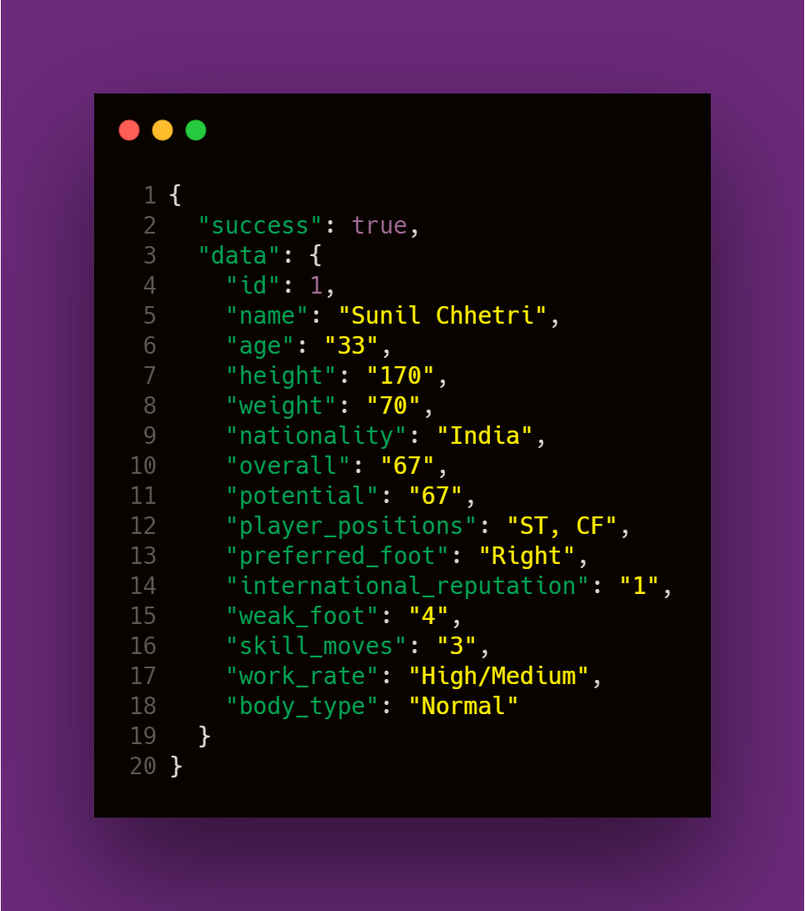

# Indian Football API (2019-Stats)

### Nation Team 2019-20 Squad API 

OutCome: 




CheckList:

- [x] Static Colleges API
- [ ] PostgreSQL DB Backend

## Run

```
# This project uses Denon
deno start
```

## Routes

```
GET      /api/v1/players      -[x]Static  -[x]Database
GET      /api/v1/player/:id   -[x]Static  -[x]Database
POST     /api/v1/player       -[x]Static  -[x]Database
PUT      /api/v1/player/:id   -[-]Static  -[x]Database
DELETE   /api/v1/player/:id   -[x]Static  -[x]Database
```